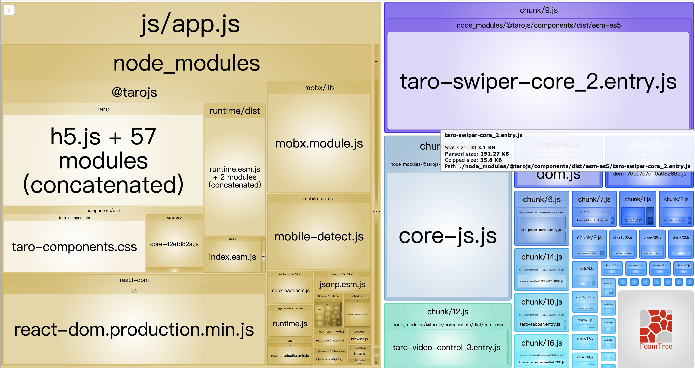

# Taro 3.x 项目模板

开箱即用的基于 Taro3 的 React 框架多端项目模版。

本项目还有基于 Taro 2.x 和 1.x 的版本，请点击以下链接前往：

- [基于 Taro1.x 的模版](https://github.com/lexmin0412/taro-template/tree/1.x)
- [基于 Taro2.x 的模版](https://github.com/lexmin0412/taro-template/tree/2.x)

## 技术栈

- Taro
- React Hooks
- TypeScript
- SCSS

## 支持特性

- 🏠 基于 Taro3
- 📦 支持 React
- 🐑 CSS 预处理器( SCSS )
- 🥣 完全使用 TypeScript 开发
- 🔛 企业级的 request 类及拦截器封装
- 👮 `eslint`+`stylelint`+`prettier`+`commitlint`+`editorConfig` 实现的无死角代码规范体系
- 💰 更多更好功能等你发现...

## 优化

1. 如果 h5 端编译后体积过大，可以使用 webpack-bundle-analyzer 插件对打包体积进行分析。

```js
module.exports = {
  h5: {
    webpackChain(chain) {
      chain
        .plugin('analyzer')
        .use(require('webpack-bundle-analyzer').BundleAnalyzerPlugin, [])
    },
  },
}
```

在打包之后将会在浏览器中打开类似如下的页面，可以对文件占用体积分析，进行相关优化。


