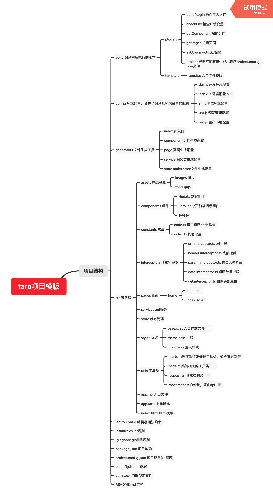

# Taro 2.x 项目模版

> 说明：master 分支同步taro最新稳定版本更新，且会持续添加新功能，测试通过后会合并至release分支，当前版本基于taro 2.2.3；
> 基于 taro 1.x 的项目模板请前往 `release-1.0.0` 分支获取，[点此前往](https://github.com/cathe-zhang/taro_template/tree/release-1.0.0/)

## 导航

- [功能列表](#功能列表)
- [项目结构](#项目结构)
- [开始](#开始)
- [开发](#开发)
  - [编译](#编译)
  - [预置功能](#预置功能)
  - [基础开发](#基础开发)
    - [请求数据](#请求数据)
      - [创建service](#创建service)
      - [直接调用service获取数据](#直接调用service获取数据)
    - [组件](#组件)
      - [1.定义组件](#1.定义组件)
      - [2.在页面中引用](#在页面中引用)
  - [开发规范](#开发规范)
    - [ESLint](#ESLint)
    - [静态资源导入规范](#静态资源导入规范)
    - [类名规范](#类名规范)
  - [代码/性能优化](#代码/性能优化)
- [部署](#部署)
- [技术栈](#技术栈)
- [后续工作](#后续工作)
- [问题记录](#问题记录)
  - [Taro升级问题](#Taro升级问题)
  - [其他](#其他)
- [优化](#优化)
  - [taro-ui样式引入](#taro-ui样式引入)
  - [官方优化指南](#官方优化指南)

## 功能列表

- 基础功能支持
  - [x] TypeScript
  - [x] Sass，全局注入公用样式文件
  - [x] UI库（taro-ui）
  - [x] 状态管理（mobx）
  - [x] 异步编程（async/await）
  - [x] 引入字体（iconfont）
- 接口请求
  - [x] request类
  - [x] 拦截器
    - [x] url拦截器
    - [x] header拦截器
    - [x] param拦截器
    - [x] data拦截器
  - [x] 开发环境本地代理（h5端）
  - [x] jsonp支持（h5端）
- 调试
  - [x] vconsole（h5端）
- 工程化
  - [x] 全局变量
  - [x] 插件
    - [x] 环境变量检查
    - [x] 扫描components文件夹生成入口文件
    - [x] 扫描pages文件夹生成路由列表及app.tsx文件
    - [x] 根据不同的环境变量生成不同的project.config.json（小程序端）
  - [x] 通过plop插件一键生成模版文件（页面、组件、样式、服务类、mobx状态管理）
  - [x] 底层组件，用于页面和组件继承，实现类似vue原型绑定的功能
  - [ ] git hooks
    - [ ] eslint
    - [ ] stylelint
    - [ ] prettier
    - [x] commit lint
  - [ ] 引入自建组件库(taro-cui，适配taro2.0版本开发中)
  - [x] 引入自建工具类库（wtils）
  - [ ] 接入 Taro 模版源 http://taro-docs.jd.com/taro/docs/template.html
  - [ ] 提交 Taro 物料市场 https://taro-ext.jd.com/
- 组件
  - [x] Card 卡片组件 提供圆角、阴影功能，可自定义类名、样式（圆角及内外边距）
  - [x] Countdown 倒计时组件，可自定义结束时间、自定义倒计时长、是否展示天，自定义item样式
  - [x] Divider 分割线，可自定义高度
  - [x] Nodata 缺省组件 可自定义图片、文字、宽高
  - [x] Paging 分页提示组件 将scrollerLoader, scrollerEndMessage合并成一个组件，减少判断
  - [x] Modal 基础弹窗组件，可选择弹窗位置，包括中间弹窗、底部弹窗，抛出关闭回调
  - [x] Tabs 标签页
  - [x] TButton 按钮组件，可自定义类名、自定义宽高、背景色、圆角、positionType
  - [x] TImage 图片组件 提供错误处理、loading过渡、查看大图等功能
  - [x] TImageUploader 图片上传组件 基于image 提供上传图片、图片数量限制、删除图片、查看大图等功能
- 工具类
  - [x] img.ts 图片处理类（如拼接url、预览等）
  - [x] mp.ts 小程序独有api封装（如检查更新）
  - [x] page.ts 页面工具类，实现获取页面路由、跳转等功能
  - [x] toast.ts loading/toast api封装简化
  - [x] validator.ts 表单验证
  - [x] meta.ts meta相关功能
- 体验工程
  - [ ] 骨架屏

## 项目结构

以下是项目结构的缩略图



## 开始

```zsh
# 获取模版
git clone https://github.com/cathe-zhang/taro_template.git
# 进入项目文件夹
cd taro_template
# 安装依赖
yarn
# 本地浏览器运行
yarn dev:h5
# 本地小程序运行
yarn dev:mp
```

## 开发

### 编译

为了提高开发体验、调整了默认taro模版的部分编译命令，也为不同服务器环境（包括dev/sit/uat/pro）、不同编译模式（开发/打包）、不同运行环境（h5/小程序）提供了统一的命令。

新增的服务器环境参数，主要是考虑到在处理线上问题时，为了复现问题，经常需要在本地请求非开发环境的接口，这时候习惯的操作是去更改配置文件，而更改配置文件的风险是很高的，不仅操作繁琐，更容易在多人开发时造成冲突，甚至可能将测试的变量提交到生产环境，造成不必要的线上问题。

编译命令格式如下：

```shell
yarn <mode>:<platform>-<env>
```

`mode`，编译模式：

- dev 本地开发
- build 服务器部署

`platform`，运行环境

- mp 微信小程序
- h5 h5

`env`，服务器环境标识，不同标识对应着不同的配置项，如接口host

- sit 测试环境
- uat 预发环境
- pro 生产环境
- 空  开发环境

示例：

```shell
yarn dev:mp  # 本地开发 小程序 开发环境
yarn dev:mp-sit  # 本地开发 小程序 测试环境
yarn build:mp   # 部署 小程序 开发环境
yarn build-mo-pro  # 部署 小程序 生产环境
```

完整的编译命令列表详见 [package.json](./package.json) 中的 `scripts` 配置项。

### 预置功能

在开发阶段，为了减少一些重复且枯燥，还有可能造成报错的代码，做了以下几个工作：

- 通过命令生成文件
- pages和components文件夹的扫描
- 公用sass文件的全局注册

1. **通过命令生成文件**

对于文件的新建操作，在项目中也预置了命令，开发者只需在命令行中输入  `yarn template`，然后根据相关提示输入对应的配置项，即可生成对应的文件，目前支持以下四种文件的快捷创建：

- 页面（同时生成对应的scss和ts类型生命文件）
- 组件（同时生成对应的scss文件）
- mobx模块
- service类

2. pages和components文件夹的扫描

在平常的项目开发中，存在以下问题：

- 每新建一个页面文件，就需要在app.tsx中的pages配置项中追加一行；
- 每一个组件的引用，都需要另起一行，引用到具体的组件存放路径

pages 文件夹的扫描，是基于pages目录及其所有文件夹及文件夹下的文件名，生成一个路由文件routes.js，再读取这个路由文件，追加到app.tsx模版文件的pages配置项中去。

components 文件夹的扫描，跟pages目录同理，但生成的是一个index.ts文件，自动引入了components文件夹下的所有组件并导出，这样做的目的是在多个组件引用时，不需要每一个组件的引用都另起一行，而可以通过如下方式书写：

```tsx
import { Line, TImage } from '~/components
```

3. 公用sass文件的全局注册

在 config/index.js 中预置了如下内容：

```js
// config/index.js
{
	sass: {
    // 全局注入scss文件
    resource: [
      'src/styles/classes.scss',
      'src/styles/mixin.scss',
      'src/styles/theme.scss',
      'src/styles/var.scss'
    ],
    // 指定项目根目录，这样在resource字段中就不需要重复书写path.resolve了
    projectDirectory: path.resolve(__dirname, '..')
  },
}

```

作用是全局注入了mixin.scss 和 theme.scss，这样做之后，在项目内的所有scss文件中，可以直接使用这两个文件中的所有特性而不需要引入对应的文件，如果有更多的公用文件注入，只需要修改这里的配置项即可（注意：修改后需要重启项目才能生效）。（**TODO：后续需要在编译插件中扫描styles文件夹，省去配置项追加的操作**）

```scss
// pages/index/index.scss
.index-page {
  background-color: $body-bg;   // 变量来自styles/theme.scss
  
  .block-title {
    @include textOrient(1);    // textOrient来自styles/
  }
}
```

### 基础开发

#### 请求数据

在页面中请求数据，需要先做一个判断：当前这个接口的数据需不需要跨页面共享，如果不需要，那么就没有必要经过dva，直接调用 service 即可；反之则需要定义 model , 在页面上发起 action, 走 dva 的流程。

##### 创建service

service, 也就是我们的服务模块，用于统一存放后端接口定义，供页面调用。

**`service`文件设计规范**

由于同一个接口被不同页面调用调用的可能性非常高，服务模块的结构需要依照后端接口来设计，如项目内既包含了公司后端项目的接口请求，又需要请求第三方接口，那么 service 模块就要分成两个大的模块，大的模块下面再根据接口模块划分来划分小的 service 文件。

如一个接口路径为 `https://xxx.normal.com/webapi/account/queryBalanceAccount`, 用途是查询用户账户余额，那么这个接口在 service 模块的结构就应该表现为：

首先分为两个大的模块，下一层是后台的项目，最后根据后台接口模块命名一个 `xxx.service.ts`, xxx 是后台的模块名称。只要一个接口是在后台接口项目中的这个子模块，那么在前端就应该定义在相应的 service 文件下。

上面的示例接口设计结构如下：

```bash
├── services        服务根文件夹
|   ├── inside        内部服务
|   ├── qqMap         腾讯地图api接口
|   		├── ws.service.ts    webservice服务
```

##### 直接调用service获取数据

```tsx
import QQMapWSService from '~/services/qqMap/ws.service'

class Index extends Component {

  state = {}

  componentDidMount() {
    this.handleJSONPTest()
  }
  
  // 直接调用service
  async handleJSONPTest() {
    const result = await QQMapWSService.geocoder({
      location: `28.2532,112.87887`,
      get_poi: 0,
    })
    this.setState({
      locationData: result.data
    })
    console.log('result', result)
  }

  render() {
    const { locationData } = this.state
    return (
      <View className='home-index-page'>
        {
          locationData &&
            <View>
              当前位置：{locationData.latitude}，{locationData.longitude}
            </View>
        }
      </View>
    )
  }
}
```

#### 组件

在业务开发的过程中，我们常需要复用一些相同的结构，如商品轮播图，订单item等，如果每个页面都复制粘贴一遍，不仅不美观，更难以维护，这时候就需要开发组件了。

组件分为展示型组件和容器型组件。展示型组件只需要接收父组件传递的属性并渲染页面，容器型组件则会涉及到数据处理等复杂的逻辑，难以重用，所以平常我们开发的一般都是展示型的组件。

在项目模板中已经包含了数个常用的基础组件，可直接使用，引用方式：

```tsx
import { Card, TImage } from '~/components'
```

在编译前已经进行了 components 文件夹的扫描操作，自动生成了 components/index.ts，而 `~/components` 会指向 src/components/index.ts 文件，所以可以直接通过以上方式引用。

##### 1. 定义组件

通过 yarn template 命令新建组件，会生成如下模版：

```tsx
/**
  * ComponentDesc
  */

import { ComponentClass } from 'react'
import Taro, { Component } from '@tarojs/taro'
import { View } from '@tarojs/components'

import './ComponentName.scss'

/**
 * props属性
 */
interface IProps {
  /**
   * 子元素
   */
  children?: any;
}

/**
 * 组件内部属性
 */
interface IState {

}

interface ComponentName {
  props: IProps;
  state: IState;
}

class ComponentName extends Component {

  static defaultProps: IProps = {

  }

  render () {
    return (
      <View className="ComponentName-comp">
        ComponentDesc
      </View>
    )
  }
}

export default ComponentName as ComponentClass<IProps, IState>
```

基于以上模版，我们就可以开始组件的具体逻辑开发了。

##### 2. 在页面中引用

```tsx
import { ComponentName } from '~/components'
```

### 开发规范

#### ESLint

代码书写规范请遵循 [Taro 规范](http://taro-docs.jd.com/taro/docs/spec-for-taro.html)，后续会有更完善的规范补充。

#### 静态资源导入规范

  一个页面文件导入模块时应该按照如下规范：

    1. 先导入第三方模块，如第三方UI库等
    2. 再导入项目内部模块，如组件、工具类等
    3. 导入静态文件，图片在前，其他资源次之，样式文件最后

  示例：

  ```tsx
  // 导入第三方库
  import Taro, { Component, Config } from '@tarojs/taro'
  import { View, Text } from '@tarojs/components'
  import { connect } from '@tarojs/redux'
  import { ComponentClass } from 'react';

  // 导入项目内部模块
  import Line from '~/components/Line'
  import Toast from '~/utils/toast'

  // 导入静态文件和样式
  import './index.scss'
  ```

#### 类名规范

- 页面容器应以模块-文件名-容器类型命名，如 home-index-page, line-comp 等

- 样式

```scss
.index-page {
  background: $theme-color;
}
```

### 代码/性能优化

请基于以下文档优化：

- [Taro最佳实践](http://taro-docs.jd.com/taro/docs/best-practice.html)
- [Render Props](http://taro-docs.jd.com/taro/docs/render-props.html)
- [Taro性能优化实践](http://taro-docs.jd.com/taro/docs/optimized-practice.html)

## 部署

根据 [package.json](./package.json) 文件中的 scripts 配置项，在对应的自动化部署工具（如jenkins）中进行相应的配置即可。编译命令说明 [详见](#编译)

## 技术栈

- [taro](https://nervjs.github.io/taro/docs/README.html)
- [taro-ui](https://taro-ui.aotu.io/)
- [mobx](https://cn.mobx.js.org/)
- [typescript](https://www.tslang.cn/docs/handbook/basic-types.html)
- [scss](https://www.sass.hk/)

## 后续工作

- [ ] Taro中的hooks与mobx结合？
- [ ] 根据2.0迁移指南进行优化 https://nervjs.github.io/taro/docs/migrate-to-2.html
- [ ] 组件使用外部样式类 https://nervjs.github.io/taro/docs/component-style.html#%E5%A4%96%E9%83%A8%E6%A0%B7%E5%BC%8F%E7%B1%BB 
- [ ] render-props融合 https://nervjs.github.io/taro/docs/render-props.html
- [ ] context融合 https://nervjs.github.io/taro/docs/context.html
- [ ] 研究拦截器在每次发起request时执行的可行性

## 问题记录

### Taro升级问题

#### 使用 async/await 在小程序中报 `regeneratorRuntime is not defined`

原因：没有async await支持  

解决方案：

- https://nervjs.github.io/taro/docs/async-await.html#docsNav
- https://nervjs.github.io/taro/docs/migrate-to-2.html

### 其他

#### 小程序中无法识别类型声明独立文件的操作

解决方案：不将类型声明独立文件，此问题需要后续观察。

#### h5中 调用chooseImage，点击取消按钮无法不会进入 success fail complete中的任何一个回调

解决方案：loading放在success回调中 上传之前开始展示

## 优化

### taro-ui样式引入

```scss
// app.scss

// 方式1: 一次性引入所有样式
@import '~taro-ui/dist/style/index.scss';

// 方式2: 在使用到新的组件时才引入
@import "~taro-ui/dist/style/components/noticeBar.scss";
@import "~taro-ui/dist/style/components/tag.scss"
```

对于上面的情况，如果在项目中只使用到了 taro-ui 中的 Button 和 Tag 组件，打包后的 app.css 体积从 210kb 减少到 53kb，只要打包后生成的app.css 文件小于210kb，那么这种引入方式就是值得的。

## 不想百度的操作

### 切换npm源 

  ```shell
  npm config set registry https://registry.npmjs.org/
  ```

## 项目文档

- [常见问题记录](./problems.md)
